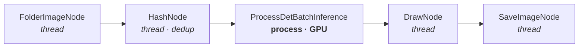

# neudc — Neural Dataset Collection

**A streaming pipeline framework for pre-annotating object-detection datasets.**

Point it at a stream of images, wire up a graph of nodes — dedup, detect, embed, select,
save — and get a pre-labelled dataset ready for human review.

[](LICENSE)
[](https://www.python.org/downloads/)
[](https://github.com/psf/black)

---

## ✨ What it does

- **Declarative pipelines.** Describe a node graph in YAML; the framework wires the
  transport, spawns the workers and validates the config before anything starts.
- **Nodes run where they should.** Light nodes (readers, resize, filters) run as threads;
  heavy nodes (model inference) run as separate processes, so they get their own GIL and GPU context.
- **Lossless transport.** Nodes talk over ZeroMQ **PUSH/PULL** — messages are queued rather
  than dropped, and a full high-water mark applies backpressure to the producer.
- **Batteries for dataset work.** Perceptual-hash dedup, detection, embeddings,
  active-learning selection and dataset assembly ship as nodes.
- **Observable.** Optional Prometheus metrics endpoint, per-node health monitoring.

## 🧭 How it works

Every node owns a mailbox. Producers `PUSH` to the mailbox of each downstream node they
declare in `outputs`; each edge is an independent 1:1 channel, so fan-out is just several
edges. Messages are `Frame` objects (image + boxes + metadata), serialized once per send
with pickle protocol 5 and reused across all edges.



A rendered architecture diagram lives in [`assets/schema/neudc.pdf`](assets/schema/neudc.pdf).

## 🚀 Quick start

```bash
git clone https://github.com/Bleaff/data_pipeline_orchestration.git
cd data_pipeline_orchestration
python3 -m venv env && source env/bin/activate
python3 -m pip install -e .
```

Run the bundled CPU-only example (no GPU, no model required — put some images in
`assets/images/` first):

```bash
python3 -m neudc.entrypoints.main assets/configs/example_cpu_pipeline.yaml
```

Run several pipelines side by side, each in its own process:

```bash
python3 -m neudc.entrypoints.main_multipipe assets/configs/multipipe.yaml
```

## ⚙️ Configuration

A pipeline is a list of nodes. Each node has an `id`, a `type`, its own parameters, and
`outputs` — the ids it forwards frames to.

```yaml
nodes:
  - id: reader
    type: FolderImageNode
    folder_path: "assets/images"
    mode: "loop"            # "loop" cycles forever, "only_one" stops after one pass
    frame_delay: 0.1
    outputs: [resize]

  - id: resize
    type: ResizeNode
    target_width: 640
    target_height: 480
    outputs: [saver]

  - id: saver
    type: SaveImageNode
    save_dir: "./output_images"
    outputs: []
```

The config is validated at startup, so mistakes fail fast and legibly: an unknown node
`type`, a duplicate `id`, or an `outputs` entry that points at no node are all rejected
before a single frame moves.

Optional metrics endpoint:

```yaml
prometheus:
  enable: true
  port: 8000
```

### Environment variables

| Variable | Default | Purpose |
|---|---|---|
| `NEUDC_LOG_LEVEL` | `INFO` | `DEBUG` / `INFO` / `WARNING` / `ERROR` / `CRITICAL` |
| `NEUDC_LOG_FILE` | *(unset)* | Path to a rotating log file. Opt-in — off by default to keep the hot path free of disk I/O. |

## 🧩 Available nodes

| Node | Runs as | What it does |
|---|---|---|
| `FolderImageNode` | thread | Reads images from a folder (`folder_path`, `mode`, `frame_delay`) |
| `ResizeNode` | thread | Resizes frames (`target_width`, `target_height`) |
| `ResizeProcessNode` | process | Same, isolated in its own process |
| `HashNode` | thread | Perceptual-hash dedup filter (`delta`, `hash_size`, `hash_type`) |
| `DrawNode` | thread | Draws detected boxes onto the frame |
| `SaveImageNode` | thread | Writes frames to disk (`save_dir`) |
| `ProcessDetInference` | process | Single-frame object detection (`model_config`) |
| `ProcessDetBatchInference` | process | Batched object detection (`batch_size`, `model_config`) |
| `ProcessBlurInference` | process | Blur detection / filtering |
| `ProcessEmbeddingInference` | process | Batched embedding extraction |
| `ActiveLearning` | thread | Selects frames worth human labelling |
| `CreateDataset` | thread | Assembles the resulting dataset |

Model-backed nodes take a `model_config` naming the backend (`TorchBackend`,
`ONNXBackend`, `TRTBackend`), the weights `path` and the `device_id` (`-1` for CPU).

## 🛠 Development

```bash
python3 -m pip install pre-commit
pre-commit install
pre-commit run --all-files
```

Run the tests:

```bash
python3 -m pytest test
```

Optional extras: `pip install -e ".[dev]"`, `".[trt]"` (TensorRT), `".[onnx]"` (ONNX Runtime).

## 🗺 Roadmap

Planned work is tracked on the [project board](https://github.com/users/Bleaff/projects/6):
zero-shot / open-vocabulary labelling, video support with tracking and label propagation,
a control-plane API with a dashboard, shared-memory image transport, and diffusion-based
image generation (local models or hosted API endpoints).

## 📄 License

Copyright (C) 2025–2026 Sergey Sysoev

This project is licensed under the GNU Affero General Public License v3.0 or later
(AGPL-3.0-or-later). See [LICENSE](LICENSE) for the full text.

Note that the AGPL requires anyone who runs a modified version of this software as a
network service to make the corresponding source code available to its users.
