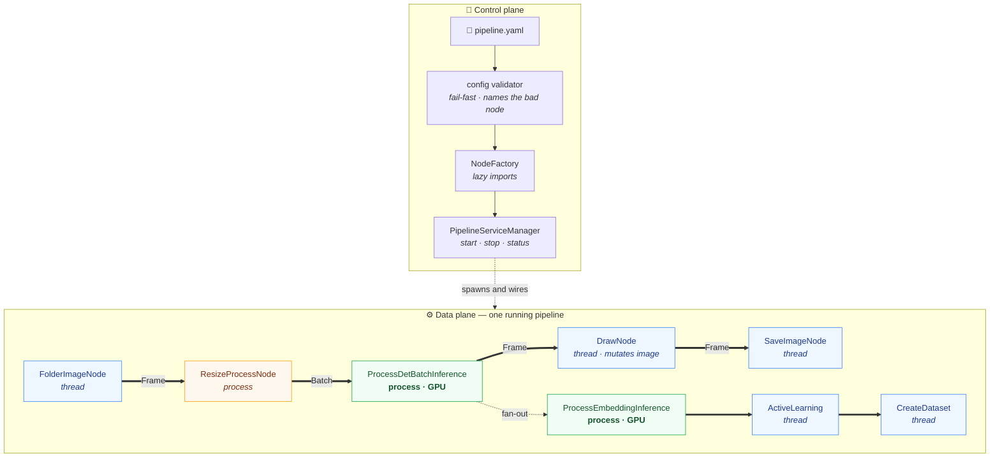
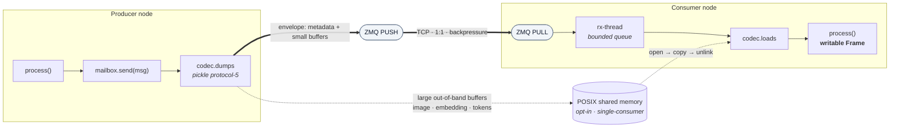

# neudc — Neural Dataset Collection

**A streaming pipeline framework for pre-annotating object-detection datasets.**

Point it at a stream of images, wire up a graph of nodes — dedup, detect, embed, select,
save — and get a pre-labelled dataset ready for human review.

[](LICENSE)
[](https://www.python.org/downloads/)
[](https://github.com/psf/black)

---

## ✨ What it does

- **Declarative pipelines.** Describe a node graph in YAML; the framework wires the
  transport, spawns the workers and validates the config before anything starts.
- **Nodes run where they should.** Light nodes (readers, resize, filters) run as threads;
  heavy nodes (model inference) run as separate processes, so they get their own GIL and GPU context.
- **Lossless transport.** Nodes talk over ZeroMQ **PUSH/PULL** — messages are queued rather
  than dropped, and a full high-water mark applies backpressure to the producer.
- **Batteries for dataset work.** Perceptual-hash dedup, detection, embeddings,
  active-learning selection and dataset assembly ship as nodes.
- **Observable.** Optional Prometheus metrics endpoint, per-node health monitoring.

## 🧭 How it works

neudc has two planes. The **control plane** turns a YAML file into a running graph:
the config validator fails fast (and names the offending node), the `NodeFactory` lazily
imports only the node types in use, and the `PipelineServiceManager` spawns and wires them.
The **data plane** is the graph itself — each node runs as its own thread or process and
owns a mailbox; producers `PUSH` to each downstream node they declare in `outputs`, so
every edge is an independent 1:1 channel and fan-out is just several edges.



**Message transport.** A message (`Frame` = image + boxes + metadata, or a `Batch`) is
serialized once per send with pickle protocol 5 and the same bytes feed every edge. Large
buffers can travel *beside* the pickle stream through POSIX shared memory instead of over
TCP — opt-in via `NEUDC_SHM_IMAGES`, and only on single-consumer edges (fan-out keeps
everything in-band to avoid a race on unlink). The consumer copies the buffer into its own
**writable** memory, because nodes like `DrawNode` mutate the image in place.



A rendered architecture diagram lives in [`assets/schema/neudc.pdf`](assets/schema/neudc.pdf).

## 🚀 Quick start

```bash
git clone https://github.com/Bleaff/data_pipeline_orchestration.git
cd data_pipeline_orchestration
python3 -m venv env && source env/bin/activate
python3 -m pip install -e .
```

Run the bundled CPU-only example (no GPU, no model required — put some images in
`assets/images/` first):

```bash
python3 -m neudc.entrypoints.main assets/configs/example_cpu_pipeline.yaml
```

Run several pipelines side by side, each in its own process:

```bash
python3 -m neudc.entrypoints.main_multipipe assets/configs/multipipe.yaml
```

## ⚙️ Configuration

A pipeline is a list of nodes. Each node has an `id`, a `type`, its own parameters, and
`outputs` — the ids it forwards frames to.

```yaml
nodes:
  - id: reader
    type: FolderImageNode
    folder_path: "assets/images"
    mode: "loop"            # "loop" cycles forever, "only_one" stops after one pass
    frame_delay: 0.1
    outputs: [resize]

  - id: resize
    type: ResizeNode
    target_width: 640
    target_height: 480
    outputs: [saver]

  - id: saver
    type: SaveImageNode
    save_dir: "./output_images"
    outputs: []
```

The config is validated at startup, so mistakes fail fast and legibly: an unknown node
`type`, a duplicate `id`, or an `outputs` entry that points at no node are all rejected
before a single frame moves.

A node can optionally declare `control_outputs` — ids it sends priority control-plane
messages to (e.g. turn cancellation / barge-in for streaming pipelines). These travel
over a second channel, entirely independent of `outputs`/the data FIFO, so a cancel
signal is never stuck behind a backlog of data it is meant to interrupt. A node with no
`control_outputs` (the default, `[]`) simply has no control channel wired up and behaves
exactly as before this existed.

Optional metrics endpoint:

```yaml
prometheus:
  enable: true
  port: 8000
```

Every node exposes a common set of Prometheus metrics, all labeled by `node`:

| Metric | Type | Meaning |
|---|---|---|
| `neudc_node_queue_depth` | Gauge | Current depth of the node's internal message queue |
| `neudc_node_queue_hwm` | Gauge | Configured ZMQ high-water mark for the node's mailbox |
| `neudc_node_queue_drops_total` | Counter | Messages dropped from the node's inbound queue under `queue_policy: drop_oldest`/`conflate`, labeled by `reason` |
| `neudc_node_messages_processed_total` | Counter | Messages `process()` completed successfully |
| `neudc_node_process_latency_seconds` | Histogram | `process()` wall-clock latency per attempt |
| `neudc_node_errors_total` | Counter | `process()` exceptions raised (including retried attempts) |
| `neudc_node_retries_total` | Counter | Retry attempts under an `on_error: retry` policy |
| `neudc_node_dropped_total` | Counter | Messages dropped after the error policy gave up |
| `neudc_node_dead_lettered_total` | Counter | Messages written to a node's dead-letter sink |
| `neudc_node_failures_total` | Counter | Times a node gave up under an `on_error: fail` policy |
| `neudc_node_health` | Gauge | Node health as observed by its own run loop (1=healthy, 0=unhealthy) |

A ready-made dashboard for these is at
[`docs/grafana/neudc-dashboard.json`](docs/grafana/neudc-dashboard.json) — import it
into Grafana against your Prometheus datasource.

**Process nodes and multiprocess mode.** Inference nodes run in a separate OS process
(`BaseProcessNode`), so by default their metrics live in that process's own private
registry — invisible to the endpoint above, which only serves the main process. To make
process-node metrics visible too, set `PROMETHEUS_MULTIPROC_DIR` to a writable, empty
directory *before starting the pipeline* (this is a hard requirement of
[`prometheus_client`'s multiprocess mode](https://github.com/prometheus/client_python#multiprocess-mode-eg-gunicorn),
not a neudc-specific setting — the env var must exist before `prometheus_client` is first
imported anywhere in the process tree):

```bash
export PROMETHEUS_MULTIPROC_DIR=/tmp/neudc-prometheus
mkdir -p "$PROMETHEUS_MULTIPROC_DIR"
python -m neudc.entrypoints.main config/pipeline.yaml
```

Without it, only same-process (`BaseThreadedNode`) metrics are visible — the historical,
single-process behaviour.

### Error policy

Any node may declare what happens when its processing raises. Without the block a
node logs the exception and drops the message — the historical behaviour.

```yaml
  - id: detector
    type: ProcessDetInference
    outputs: [saver]
    error_policy:
      on_error: retry          # skip (default) | retry | fail
      max_retries: 3
      initial_backoff: 0.1     # seconds before the first retry
      backoff_multiplier: 2.0  # each retry waits this much longer
      max_backoff: 5.0         # …up to this cap
      jitter: true             # spread delays so nodes don't retry in lockstep
      dead_letter_dir: "./dead_letter"
      store_payload: false     # also pickle the message next to the record
```

| `on_error` | Behaviour |
|---|---|
| `skip` | Log, dead-letter, drop the message, keep going. The default. |
| `retry` | Re-run `process()` up to `max_retries` times with exponential backoff, then dead-letter and drop. Requires `max_retries >= 1`. |
| `fail` | Dead-letter and stop the node, which brings the whole pipeline down. |

With `dead_letter_dir` set, every message that could not be processed is appended as
one JSON object to `<dir>/<node_id>.jsonl` — the error, its traceback, and whatever
identifies the message. Payloads are not written unless `store_payload` is on, since a
dead-lettered frame would otherwise cost megabytes per record.

Two things to know before choosing `retry`:

- Only `process()` is retried, never the send that follows it — re-sending would
  deliver the message twice.
- `process()` must tolerate a second call on the same message. Nodes that mutate it in
  place (`DrawNode` draws onto `frame.image`) would retry on a half-modified message;
  use `skip` for those.

The block is validated with the rest of the config, so a typo or a contradictory
setting (`on_error: retry` with no retries) is rejected at startup, naming the node.

### Health monitor

Process nodes (`BaseProcessNode`) run a background health monitor that judges
liveness by whether the node's own run loop is still cycling, not by whether it has
recently processed anything — an idle node (a scheduled reader, an event-driven node
between events, anything without a constant stream) keeps iterating its loop every
~0.1s even with nothing to collect, so it stays healthy indefinitely. A node whose
`process()` call genuinely hangs blocks the loop from returning, so it is correctly
flagged unhealthy once `health_timeout` elapses.

```yaml
  - id: detector
    type: ProcessDetInference
    health_timeout: 30          # seconds of a stalled loop before unhealthy, default 15
    health_check_interval: 5    # how often the monitor checks, default 5
    outputs: [saver]
```

Both keys are optional and fall back to `BaseProcessNode.HEALTH_TIMEOUT`/
`HEALTH_CHECK_INTERVAL` when omitted; when set they must be `> 0`, validated with the
rest of the config the same way `error_policy` is.

### Worker replicas & autoscale

Any node may run as several independent instances instead of one, e.g. to spread a
heavy inference node's load across more CPU/GPU workers:

```yaml
  - id: detector
    type: ProcessDetInference
    replicas: 3               # 3 independent instances of this node, default is 1
    outputs: [saver]
```

Each replica gets its own mailbox; a producer's single `PUSH` socket connects to
every replica's port, and ZeroMQ round-robins messages across them fairly — a
replicated node's queue depth is naturally load-balanced without any extra code.
Replica instances are named `<id>#0`, `<id>#1`, … so per-node metrics, health and
dead-letter records never collide across replicas.

An optional `autoscale` block lets the replica count grow or shrink at runtime based
on how deep each replica's own inbound queue is:

```yaml
  - id: detector
    type: ProcessDetInference
    replicas: 2
    autoscale:
      min_replicas: 1
      max_replicas: 4
      queue_depth_high: 15    # scale up by one when every replica is at/above this
      queue_depth_low: 2      # scale down by one when every replica is at/below this
      check_interval_s: 5.0
    outputs: [saver]
```

Scaling moves one replica at a time and only triggers when **every** current
replica crosses the same threshold, so one busy worker does not spin up new ones
while its siblings are idle. `min_replicas <= max_replicas` and
`queue_depth_low < queue_depth_high` are enforced at config-validation time, the
same way `error_policy` is.

> **Status:** the decision engine (`ReplicaAutoscaler.check_and_scale`) is fully
> implemented and unit-tested against injected queue-depth readers and a fake
> replica pool. It is not yet wired into `main.py`/`BasePipeline`'s live run loop —
> today, configuring `autoscale` validates but does not yet start a background
> autoscaler thread. `replicas: N` (the static count) is fully wired end-to-end.

### Inbound queue policy

Every node's mailbox has an internal inbound queue between the receiver thread and
`process()`. By default it is **lossless**: a full queue blocks the receiver (with
periodic wake-ups) so a slow consumer applies backpressure to its producer instead of
silently dropping data — correct for batch/offline labelling, where a lost frame is a
hole in the dataset.

For realtime pipelines (e.g. live audio), a consumer that falls behind should instead
discard stale data and keep working with the freshest — otherwise lag only compounds.
Any node may opt into that per-edge:

```yaml
  - id: mic
    type: AudioReaderNode
    message_queue_size: 20    # capacity of the inbound queue, default 20
    queue_policy: conflate    # block (default) | drop_oldest | conflate
    outputs: [vad]
```

| `queue_policy` | Behaviour when the queue is full |
|---|---|
| `block` | Backpressure the producer until space frees up. Lossless. The default. |
| `drop_oldest` | Discard the single oldest queued message to make room for the new one. |
| `conflate` | Discard every currently-queued message, keeping only the newest. At most one message is ever queued. |

Dropped messages are counted in `neudc_node_queue_drops_total{node, reason}` (`reason`
is `drop_oldest` or `conflate`). Dropping only ever happens to an already-deserialized
message sitting in the queue — never at the ZMQ socket level — so it is safe even with
the shared-memory buffer transport (`NEUDC_SHM_IMAGES`): by the time a message is
queued, any shared-memory segment backing it has already been copied out and unlinked.

`message_queue_size`/`queue_policy` are validated with the rest of the config: an
unknown `queue_policy` string or a non-positive `message_queue_size` is rejected at
startup, naming the node.

### LLM backends

`neudc.nn.backends.llm` provides a provider-agnostic `BaseLLMBackend` interface for
chat/VLM models, the foundation for the upcoming VLM node and copilot. It is not yet
wired into a pipeline node — for now it is built directly from a `LLMBackendConfig`:

```python
from neudc.nn.backends.llm import LLMBackendConfig, LLMBackendType, build_llm_backend
from neudc.nn.backends.llm.base import ChatMessage

config = LLMBackendConfig(
    provider=LLMBackendType.OPENROUTER,  # or LLMBackendType.LOCAL
    model_id="openai/gpt-4o",
    temperature=0.7,
    stream=False,
)
backend = build_llm_backend(config)
reply = backend.generate([ChatMessage(role="user", content="Describe this crop.")])
```

| `LLMBackendConfig` field | Default | Purpose |
|---|---|---|
| `provider` | — | `OpenRouterBackend` (hosted, HTTP) or `LocalLLMBackend` (Ollama / vLLM / llama.cpp, any OpenAI-compatible endpoint) |
| `model_id` | — | Provider-specific model identifier |
| `base_url` | `None` | Required for `LocalLLMBackend`; defaults to the public OpenRouter endpoint otherwise |
| `api_key` | `None` | For OpenRouter, falls back to the `OPENROUTER_API_KEY` env var; local runtimes usually don't need one |
| `stream` | `false` | Hint for callers to use `backend.stream(...)` instead of `backend.generate(...)` |
| `temperature`, `max_tokens`, `timeout` | `0.7`, `None`, `60.0` | Standard chat-completion tunables |

Both providers speak the same OpenAI-compatible `/chat/completions` protocol, so
`OpenAICompatibleBackend` implements the request/response handling once; each provider
subclass only fixes the endpoint and credential resolution.

### Environment variables

| Variable | Default | Purpose |
|---|---|---|
| `NEUDC_LOG_LEVEL` | `INFO` | `DEBUG` / `INFO` / `WARNING` / `ERROR` / `CRITICAL` |
| `NEUDC_LOG_FILE` | *(unset)* | Path to a rotating log file. Opt-in — off by default to keep the hot path free of disk I/O. |
| `NEUDC_SHM_IMAGES` | `0` | Opt-in POSIX shared-memory transport for large buffers (images, embeddings, …) instead of pickling them over TCP. Applies only to **single-consumer** edges; fan-out and control messages stay in-band. POSIX only. |
| `NEUDC_SHM_MIN_BYTES` | `65536` | Minimum buffer size (bytes) diverted to shared memory when `NEUDC_SHM_IMAGES` is on; smaller buffers stay in-band. |

## 🧩 Available nodes

| Node | Runs as | What it does |
|---|---|---|
| `FolderImageNode` | thread | Reads images from a folder (`folder_path`, `mode`, `frame_delay`) |
| `AudioReaderNode` | thread | Reads live audio from a pluggable device (`device`, `sample_rate`, `channels`, `chunk_duration`, `source`) |
| `ResizeNode` | thread | Resizes frames (`target_width`, `target_height`) |
| `ResizeProcessNode` | process | Same, isolated in its own process |
| `HashNode` | thread | Perceptual-hash dedup filter (`delta`, `hash_size`, `hash_type`) |
| `VadNode` | thread | Marks silent `AudioChunk`s as droppable by RMS energy (`energy_threshold`) |
| `DrawNode` | thread | Draws detected boxes onto the frame |
| `SaveImageNode` | thread | Writes frames to disk (`save_dir`) |
| `ProcessDetInference` | process | Single-frame object detection (`model_config`) |
| `ProcessDetBatchInference` | process | Batched object detection (`batch_size`, `model_config`) |
| `ProcessBlurInference` | process | Blur detection / filtering |
| `ProcessEmbeddingInference` | process | Batched embedding extraction |
| `ActiveLearning` | thread | Selects frames worth human labelling |
| `CreateDataset` | thread | Assembles the resulting dataset |
| `TextNormalizeNode` | thread | Non-CV: strips/lowercases `TextChunk.text` (`accepts`/`emits` = `TextChunk`) |

Model-backed nodes take a `model_config` naming the backend (`TorchBackend`,
`ONNXBackend`, `TRTBackend`), the weights `path` and the `device_id` (`-1` for CPU).

## 🔌 Control-plane API

`neudc.service.api` exposes `PipelineServiceManager` over HTTP/WS (#22) — the backend
for the upcoming frontend dashboard (#23). Run it with:

```bash
pip install -e ".[api]"
python3 -m neudc.entrypoints.api_server --host 127.0.0.1 --port 8000
```

| Endpoint | Method | Purpose |
|---|---|---|
| `/pipelines` | GET | List every managed pipeline and its status |
| `/pipelines/{name}/start` | POST | Validate a `{"nodes": [...], "task": {...}}` body and start it (409 if already running, 422 on a bad config) |
| `/pipelines/{name}/stop` | POST | Stop a running pipeline (404 if unknown) |
| `/pipelines/{name}/status` | GET | Single pipeline's status (404 if unknown) |
| `/pipelines/{name}/preview` | GET | Latest frame from that pipeline's `SaveImageNode`, if it has one (404 otherwise) |
| `/config/validate` | POST | Validate a `{"nodes": [...]}` body via `config_schema` without starting anything |
| `/config` | GET | Read+parse a YAML config file (`?path=...`) |
| `/metrics` | GET | Prometheus exposition of the Stage 12 registry (multiprocess-aware if `PROMETHEUS_MULTIPROC_DIR` is set) |
| `/ws/metrics` | WS | Pushes a `{metric_name: {node: value}}` JSON snapshot once per second |
| `/node-types` | GET | Catalog of registered node types with editable field specs, for the visual config builder (#24) |
| `/pipelines/{name}/labels` | GET | List frames from that pipeline's `CreateDataset` output, with box count + reviewed state (#24) |
| `/pipelines/{name}/labels/{frame_id}` | GET/PUT | Read or overwrite one frame's YOLO-format boxes; PUT marks it reviewed |
| `/pipelines/{name}/labels/{frame_id}/image` | GET | The frame's image |

`/node-types` excludes `AudioReaderNode` and the `SAHIDetector` model type — both need a
live Python object (`device`/`detector`) that isn't JSON/YAML-expressible; hand-write
YAML for those. `/pipelines/{name}/labels*` needs a `CreateDataset` node in the pipeline
(404 otherwise); reviewed state is tracked in a `.review_state.json` manifest written
alongside the dataset — there's no database anywhere in this codebase.

`/pipelines/{name}/preview` only works today if that pipeline's config includes a
`SaveImageNode` — there is no live frame tap yet (that needs a new node type, tracked
separately); it just serves the newest file the node has already written to its
`save_dir`.

> **Metrics gotcha:** `PipelineServiceManager`-started pipelines each run in their own
> OS process (`BasePipeline` is a `multiprocessing.Process`), so their metrics live in
> that child process's own private registry by default — invisible to `/metrics` and
> `/ws/metrics`. Set `PROMETHEUS_MULTIPROC_DIR` to a writable, empty directory **before**
> starting `api_server` (it must be set on the API process so every pipeline it spawns
> inherits it) to see per-node health/throughput/queue-depth data at all.

## 🖥 Frontend (#23, #24)

`frontend/` is a Next.js app over the control-plane API. See [frontend/README.md](frontend/README.md) for setup.

- `/` and `/pipelines/{name}` (#23, read-only): pipeline list, a per-pipeline node graph
  (health/throughput/queue depth), live metrics, and a feed of recent frames.
- `/builder` (#24): visual pipeline config builder — add/connect nodes from the
  `/node-types` catalog, edit their fields, validate, and start the pipeline.
- `/pipelines/{name}/review` (#24): pre-label review — drag to add/move/resize boxes
  over a frame, edit class ids, save corrections back through `/labels/{frame_id}`.
  Linked from a pipeline's detail page when it has a `CreateDataset` node.

```bash
cd frontend
npm install
cp .env.local.example .env.local
npm run dev
```

### Or via Docker

`docker-compose.yml` runs the control-plane API and the frontend as containers —
useful to avoid a local Python/Node setup just to poke at the dashboard:

```bash
docker compose up          # api on :8000, frontend on :3000, talking to each other
```

This `api` service only manages pipelines it starts itself via `POST /pipelines/{name}/start`
(a JSON-only config — no live device objects). It is **not** how pipelines needing real
hardware run (e.g. a voice-assistant-style pipeline's microphone/speaker) — those run on
the host directly and would carry their own embedded copy of this same API. Point the
dockerized frontend at a host-run pipeline's API instead of the compose file's own `api`
service like this:

```bash
API_BASE_URL=http://host.docker.internal:8000 docker compose up frontend
```

(`host.docker.internal` is resolved by Docker Desktop on macOS/Windows out of the box;
on Linux Docker Engine you'd add `extra_hosts: ["host.docker.internal:host-gateway"]`.)
Image size note: neudc's hard dependencies (torch, torchvision, ultralytics, ...) aren't
split into optional extras, so the `api` image pulls all of them regardless — expect a
slow first build. torch is at least kept CPU-only (see `Dockerfile`): PyPI's default
linux wheel bundles the full CUDA runtime as dependencies, several GB this container
would never use (no GPU access either way — Docker Desktop on macOS has none at all).

## 🛠 Development

```bash
python3 -m pip install pre-commit
pre-commit install
pre-commit run --all-files
```

Run the tests:

```bash
python3 -m pytest test
```

Optional extras: `pip install -e ".[dev]"`, `".[trt]"` (TensorRT), `".[onnx]"` (ONNX Runtime),
`".[audio]"` (`sounddevice`, for a real-microphone `AudioReaderNode` backend), `".[api]"`
(`fastapi`/`uvicorn`, for the control-plane API).

## 🗺 Roadmap

The full roadmap lives in [docs/ROADMAP.md](docs/ROADMAP.md); task status is tracked on the
[project board](https://github.com/users/Bleaff/projects/6). Highlights:
zero-shot / open-vocabulary labelling, video support with tracking and label propagation,
a control-plane API with a dashboard, shared-memory image transport, and diffusion-based
image generation (local models or hosted API endpoints).

## 📄 License

Copyright (C) 2025–2026 Sergey Sysoev

This project is licensed under the GNU Affero General Public License v3.0 or later
(AGPL-3.0-or-later). See [LICENSE](LICENSE) for the full text.

Note that the AGPL requires anyone who runs a modified version of this software as a
network service to make the corresponding source code available to its users.
